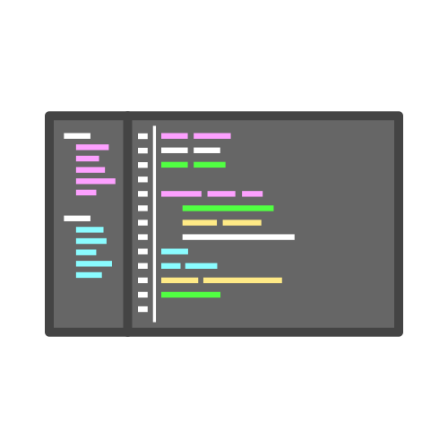

  
  

   Hi everyone, My name is
    <a href="https://www.linkedin.com/in/luan-rodrigues-823570220/">Luan Rodrigues😀</a> and I'm Frontend Developer, 
  

  
  
  

    <strong>
    📧 Message me!
    </strong>
  

  

 
  

    <strong>
      ✅ Skills
    </strong>
  

  
   
   
   

  

    <strong>💼 Tools: VSCode, Figma, Git e GitHub</strong> 
  

  

  

    <strong>
      ➡️ Social Media
    </strong>
  

  
   
  

  
  

